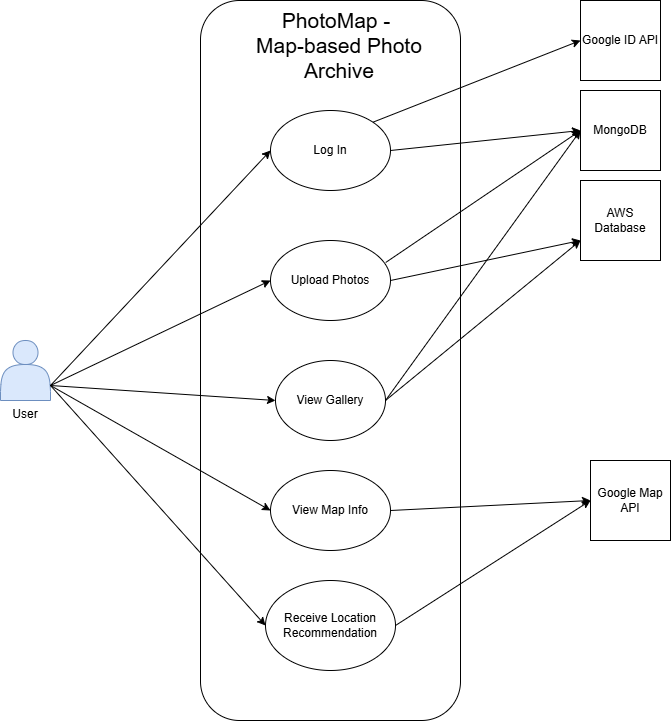
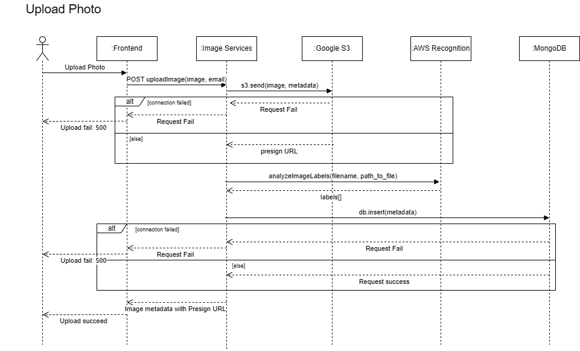
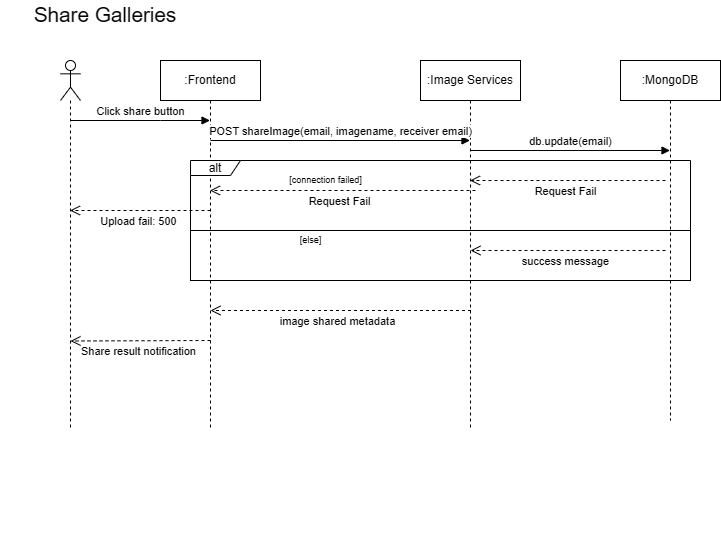

# M3 - Requirements and Design

## 1. Change History
1. Separated user authentication (via Google OAuth) from Manage Accounts. (2.12.2024)
    -  Authentication was entangled as a smaller use case in Manage Accounts. Now, delineate authentication so users seperately log in. After, allow edits to username, profile picture.etc. 

2. Specify new User - Location matching algorithm: identify elements in photo and generate "tags" for users. Then, recommend users to users or location based on tag similarity, proximity, and preference. (2.12.2024)

    - Original technical highlight was on banning/unbanning users, a secondary functionality compared to our app's purpose.
    - Therefore, the recommendation become our main complexity of our project

3. Elaborated NFR 1 and changed NFR2 to be specific and measurable (2.12.2024)

    - NFR1 lacked a concrete justification to the upload speed. 
    - NFR2 was updated to a more measurable problem. 

4. Modify the interface of component, remove some interfaces that are actually implement in frontend, and add the reasonable input and output. Also, add the new interface. (2.17.2024)

    - Also, need to modify the sequencal diagram, will modify them one by one to fit our new logic

5. Due to our TA suggestion. We put our main effort on recommendation logic, 
therefore the ban algorithm is not implement yet. Therefore, the main actor of our current program is only user. The actor Administrator does not have a special power right now. 
(Some administrator interfaces have been implemented, but they are currently mainly used as testing features.) (2.20.2024)

6. Modify the use case and scenario
    - Remove the supervision use case, since it is not implement yet. Instead, we add a new use case: View Gallery. (2.22.2024)
    - Modify share gallery feature, remove one sub usecase. Also adjust upload photo use case, add one sub usecase (2.22.2024)
    - These changes to use case allow us to focus on addressing our primary users more, ensuring our key features match the target audience. 

7. Add new framework: AWS Route 53, and External Modules (2.20.2024)


## 2. Project Description
PhotoMap: Personalized map-based photography assistant and archive. Users can upload photos and have them displayed on the map, at the same location where the photo was taken. It will also provide recommendation information about based on user prefer locations


## 3. Requirements Specification
### **3.1. Use-Case Diagram**
<!--  --> 


### **3.2. Actors Description**
1. **Indie photographers (User)**: take photos and update locations with photos; receive recommendation of users with similar photo taken, as well as locations with potentially interesting photos. 
2. **Secondary - Administrator**: supervisor who ensures app and information follow standards; can ban improper information and user


### **3.3. Functional Requirements**
<a name="fr1"></a>

1. **Log In** 
    - **Overview**:
        1. Create Account
    
    - **Detailed Flow for Each Independent Scenario**: 
        1. **Create an Account**:
            - **Description**: The user creates a new account in the system by Google sign-in. The Google Sign-In API handles existing user log-in and creates new google users. 
            - **Primary actor(s)**: User
            - **Main success scenario**:
                1. The user navigates to the “Sign Up” page.
                2. The user is taken to the Google Sign-in API.
                3. The system confirms successful account creation and provides login prompts.
            - **Failure scenario(s)**:
                - 2a. Google Sign-in API returns Error
                    - 2a1. The system displays an error message prompting the user to try sign-in again.
                - 3a. The system cannot store the user data due to a server error or network issue.
                    - 3a1. The system displays an error message and prompts the user to try again later.

2. **Upload Photos** 
    - **Overview**:
        1. Create Marker
        2. Upload Photos
    
    - **Detailed Flow for Each Independent Scenario**:

        1. **Create Marker**:
            - **Description**: The user create marker on the map, then they can use this loaction marker to upload and view their photo
            - **Primary actor(s)**: User
            - **Main success scenario**:
                1. The user selects a location on map and click on it.
                2. The user click "create marker" button.
                3. The user input the name, and the color of this marker. Then click create. 
                4. The marker displays on the map.
            - **Failure scenario(s)**:
                - 4a. Create Error: the marker does not show on the map
                    - 4a1. The system notifies the user of failure to add marker. User is prompted to try again.

        2. **Upload Photos**:
            - **Description**: The user uploads photos from their local device to the system. 
            - **Primary actor(s)**: User
            - **Main success scenario**:
                1. The user selects “Add Photo” within their account.
                2. The user chooses one photo from their device.
                3. The user optionally enters descriptive tags or captions.
                4. The user confirms and the system uploads the photos.
                5. The system displays a success message and shows the newly uploaded photos in the user’s gallery.
            - **Failure scenario(s)**:
                - 4a. The system detects an unsupported format or an excessively large file.
                    - 4a1. The system notifies the user with an error message and aborts the upload.
                - 5a. Network or server error: the upload fails due to a connection issue.
                    - 5a1. The system notifies the user and offers the option to retry or cancel.

3. **View Map Info** 
    - **Overview**:
        1. View Map Info
    
    - **Detailed Flow for Each Independent Scenario**: 
        1. **View Map Info**:
            - **Description**: The user can pan around the map to see their markers and click on markers to see previously uploaded photos. 
            - **Primary actor(s)**: User
            - **Main success scenario**:
                1. The user navigates to the “Map” section.
                2. The system loads the map interface with the user’s current location and saved locations.
                3. The user can zoom in/out or pan around the map.
                4. The user selects a specific location or marker to view more details (e.g., addresses, user photos tagged to that location).
            - **Failure scenario(s)**:
                - 1a. The system fails to retrieve map data from the external API.
                    - 1a1. An error message is displayed indicating that the map cannot be loaded and to check internet connection.

4. **Receive Location Recommendation** 
    - **Overview**:
        1. Receive Location Recommendation
    
    - **Detailed Flow for Each Independent Scenario**: 
        1. **Receive Location Recommendation**:
            - **Description**: The system provides location recommendations in notification form, based on popular spots with high user ratings or photo upvotes. Additionally, the user may periodically receive nearby photo spot recommendations based on their current location.
            - **Primary actor(s)**: User
            - **Main success scenario**:
                1. The user clicks the button "Popular Location Notification"
                2. The system retrieves popular locations based on user photo history location, prefer photo type.
                3. The system displays the top location as an app notification to the user’s phone. More info (rating, distance, user reviews) is shown when the user clicks the notification and enters the app.
                4. The user selects a recommended location for more details or navigation assistance.
            - **Failure scenario(s)**:
                - 2a. Location services are disabled or unavailable
                    - 2a1. The system displays a message prompting the user to enable location services for better recommendations.
                - 3a. No relevant recommendations are available
                    - 3a1. The system notifies the user that there are no current recommendations and suggests waiting longer. 
                - 4a. The system encounters a server error or network issue and cannot fetch recommendations.
                    - 4a1. The system displays an error message and prompts the user to retry later.
    
6. **View Gallery** 
    - **Overview**:
        1. View Gallery
    
    - **Detailed Flow for Each Independent Scenario**: 
        1. **Supervise Account**:
            - **Description**: User can view all the image they uploaded by time, in a separated activity.
            - **Primary actor(s)**: User
            - **Main success scenario**:
                1. The user clicks the button "Gallery"
                2. The application go to a new activity page.
                3. The system try to fetch all the image for current user.
                4. The gallery page displays all photos in chronological order.
            - **Failure scenario(s)**:
                - 3a. Network or server error, cannot display the image
                    - 3a1. The system displays a error message, and suggest to click gallery and fetch image again. 
                

### **3.4. Screen Mockups**


### **3.5. Non-Functional Requirements**
<a name="nfr1"></a>

1. **Photo Gallery Upload Speed**
    - **Description**: The application should ensure that photo uploads to the gallery are achieved at a minimum of 10mB/s
    - **Justification**:  According to a study of user preference on upload speed, 10mb/s is sufficient to handle photo and video upload. Regular photos are usually 4-5 mB in size, rendering 10mB/s an appropriate speed for photo upload. A slow upload experience can frustrate users and discourage them from archiving their photos efficiently. 
2. **Photo Browsing Buffer Time**
    - **Description**: When retrieving photos and displaying them on the screen, the buffer time should be no more than 2 seconds. 
    - **Justification**:  Conventional photo album apps like IPhone Photos and Google Drive storage of viewing photos have small buffer windows. Long buffering time will reduce engagement and lead to impatience. We intend that when our app is fetching photo data from database, the time is short and the action swift. 


## 4. Designs Specification
### **4.1. Main Components**
1. **Map**
    - **Purpose**: The map component contains all the interactions with the map in our project.
    - **Interfaces**: 
        1. getRecommendation
            - **Purpose**: Get the location recommendation based on user data. This will return the information that frontend can use it to search a place. 
	        - **Parameter**: googleEmail
	        - **Return Value**: JSON format, with recommend position (latitude and longitude), and tags

2. **Image Services**
    - **Purpose**: Our project is a photomap, obviously photos are a very important part of our project. All the photo related functionalities will be counted in this component
    - **Interfaces**: 
        1. imageUpload
            - **Purpose**: Users can upload the image to let the image become a part of the photomap.
            - **Parameter**: photo (file) , uploadby (googleEmail), location (JSON object)
            - **Return Value**: image data the store in the database or error message
        2. deleteImage
            - **Purpose**: Users can delete any image they have uploaded.
            - **Parameter**: image filename
            - **Return Value**: Success Message or error
        3. getImage
            - **Purpose**: Get one image and its information from the cloud
            - **Parameter**: image filename in database
            - **Return Value**: all image information in database and a presign URL that can display the image
        4. getImagesByUploader
            - **Purpose**: Get all image and their information from the cloud for the specific user
            - **Parameter**: googleEmail
            - **Return Value**: image information in database and presign URL that can display the image for all the image
        5. getAllImages
            - **Purpose**: Get all image and their information from the cloud
            - **Parameter**: none
            - **Return Value**: image information in database and presign URL that can display the image for all the image
        6. shareImage
            - **Purpose**: Share the images selected to a specific user
	        - **Parameter**: googleEmail (current user), googleEmail(share to user), image filename
	        - **Return Value**: Success Message or error 
        7. analyzeImageLabels
            - **Purpose**: Call AWS Rekognition to indicate the tags of the image
	        - **Parameter**: image filename
	        - **Return Value**: tags of image
        7. analyzeImageModeration
            - **Purpose**: Call AWS Rekognition to indicate the moderation of the image
	        - **Parameter**: image filename
	        - **Return Value**: moderation tags of image
        8. processImage
            - **Purpose**: Convert input image to .jpg or .png format. Makesure the MIMETYPE is correct when uploading to S3
	        - **Parameter**: input file from imageUpload method
	        - **Return Value**: image with available type

3. **User**
    - **Purpose**: User component is mandatory as we will store user information. This component will include all interactions directly related to the user. Also, some functions for Administrator use only.
    - **Interfaces**: 
        1. postUser
            - **Purpose**: Upload a new user or update if user exist.
            - **Parameter**: googleEmail
            - **Return Value**:  Success Message
        2. getProfileInfo
            - **Purpose**: Users are able to view their personal profile, additional ban, warning history information for supervisor
            - **Parameter**: googleEmail
            - **Return Value**: JSON format of user's profile information
        3. updateProfile
            - **Purpose**: Request to update the personal profile.
            - **Parameter**: googleEmail, new profile information
            - **Return Value**: Success Message or error 
        4. deleteUser
            - **Purpose**: Delete a user and it's information in database
	        - **Parameter**: googleEmail
	        - **Return Value**: successed message  
        5. getUserList
            - **Purpose**: get a list of all users from data
	        - **Parameter**: none
	        - **Return Value**: JSON that contains all users with their data in database  
        6. superviseAction
            - **Purpose**: Perform actions to the user on the supervisor’s list
	        - **Parameter**: googleEmail, action
	        - **Return Value**: action result  


### **4.2. Databases**
1. **MongoDB**
    - **Purpose**: We will be using MongoDB to store and track a list of properties of users. We will store the user’s login token, status, etc. 


### **4.3. External Modules**
1. **Google Map API** 
    - **Purpose**: The graphical user interface of our project is a map, and all functionalities of the app are all around this map. Hence Google Map API is mandatory.
2. **Google ID API**
    - **Purpose**: We are planning to make users login/create accounts based on their Google account. Hence Google ID API is required.
3. **AWS Rekognition**
    - **Purpose**: We want to check if images uploaded by a user are appropriate or not, and the tags of this photo. AWS Rekognition can help us indicate that.


### **4.4. Frameworks**
1. **AWS EC2 Instance**
    - **Purpose**: Provide a online cloud for database connection between backend and frontend
    - **Reason**: It is a powerful cloud provider that can provide a stable connection cloud server
2. **AWS S3 Cloud Storage**
    - **Purpose**: Provide an online cloud data storage for image storage and is mandatory in order to use some external modules
    - **Reason**: MongoDB and SQL-like databases are not ideal for storing images. Alternatively, we will use AWS Rekognition as our model to detect uploaded images is appropriate, and it is required to use AWS S3
3. **AWS Route 53**
    - **Purpose**: Provide an domain to our EC2 instance
    - **Reason**: In case to use SSL certification. We need to have a stable domain and record our aws public DNS. Otherwise, we cannot use https to access our routes. 


### **4.5. Dependencies Diagram**
<!--  -->


### **4.6. Functional Requirements Sequence Diagram**
1. [**Manage Account**](#fr1)
<!--  -->


2. [**Upload Photos**](#fr1)
<!--  -->


3. [**View Map Info**](#fr1)
<!--  -->


4. [**Receive Location Recommendation**](#fr1)
<!--  -->


5. [**Share Galleries**](#fr1)
<!--  -->


6. [**Supervise Account**](#fr1)
<!--  -->


### **4.7. Non-Functional Requirements Design**
1. [**Photo Gallery Upload Speed**](#nfr1)
    - **Validation**: We will be using AWS S3, a cloud storage that enables multiparts uploading, optimizing file transfer by splitting large files into smaller chunks. Additionally, we will introduce an option to compress images to reduce file size. 
2. [**Data Privacy**](#nfr1)
    - **Validation**: Photo data, such as GPS location and timestamp, will be encrypted at rest using AES-256 and in transit using TLS 1.3.(Robust encryption methods) The app will store encrypted metadata in a MongoDB database with field-level encryption, ensuring only authorized users can decrypt and view location data.


### **4.8. Main Project Complexity Design**
**Location Recommendation**
- **Description**: A smart algorithm that uses the user’s data to provide a new location that user may interested in.
- **Why complex?**: This algorithm uses the user’s data history, photo locations, tags of photos. It also uses Density-Based Spatial Clustering of Applications with Noise (DBSCAN) algorithm to analyze the photo locations to provide locations that the user can easily reach.
- **Design**:
    - **Input**: User email, user photo location information, photo tags information
    - **Output**: A position include latitude and longitude, and a array of tags.
    - **Main computational logic**: Use DBSCAN to clustering the user location history. Then pick one (or more in future improve) most famous location cluster. Then, based on the position in this cluster, calculate a new position in this region. Next, use the photo information that in this cluster, to figure our the top three famous tags. 
    - **Pseudo-code**:
        ```
        async getRecommendation(req: Request, res: Response, next: NextFunction)

            // Fetch only images uploaded by this user
            const db = clinet.db("images");
            const images = await db.collection("metadata").find().toArray();

            // Filter out invalid lat/lng values
            const points = images.filter().map()

            // Fit to DBSCAN model and predict the cluster
            const clustered = DBSCAN(points)

            // Track the largest cluster
            const clusterData = clustered.features.forEach(cluster => {})

            // Get the largest cluster's data and tags
            const largestCluster = clusterData[largestIndex]
            const allTagsInLargestCluster = largestCluster.tags[]

            // Compute average lat/lng for the largest cluster
            const avgPosition: [number, number] = largestCluster.reduce().map() as [number, number];
    
            // Count tag frequencies & get the top 3 
            const tagCounts = allTagsInLargestCluster.reduce();
    
            const topTags = Object.entries(tagCounts).sort().slicS().map();


            // Send the location and tags
            res.status(200).send({
                popularLocation: {
                    position: { lat: avgPosition[1], lng: avgPosition[0] },
                    tags: topTags
                }
            });
        ```


## 5. Contributions
- Alex Cheng: Generating Sequence diagram and dependencies diagram. Modifying component's interface. Generating complexity
- Ray Yu: Generating components, and database, external modules, and frameworks
- Jiashu Long: Creating main actors, functional requirements and non-functional requirements. Also generating use-case diagram
