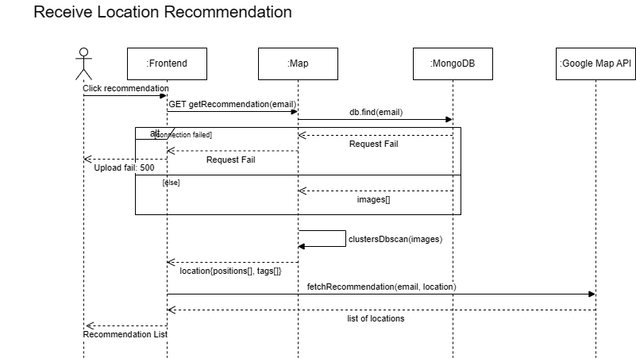

# M3 - Requirements and Design

## 1. Change History
<!-- Leave blank for M3 -->

## 2. Project Description
PhotoMap: Personalized map-based photography assistant and archive. Users can upload photos and have them displayed on the map, at the same location where the photo was taken. It will also provide recommendation information about based on user prefer locations


## 3. Requirements Specification
### **3.1. Use-Case Diagram**
<!--  -->


### **3.2. Actors Description**
1. **Indie photographers (User)**: take photos and update locations with photos; receive notifications about photo spots
2. **Administrator**: supervisor who ensures app and information follow standards; can ban improper information and user


### **3.3. Functional Requirements**
<a name="fr1"></a>

1. **Manage Account** 
    - **Overview**:
        1. Create Account
        2. Edit Account Profile
    
    - **Detailed Flow for Each Independent Scenario**: 
        1. **Create an Account**:
            - **Description**: The user creates a new account in the system by Google sign-in. The Google Sign-In API handles existing user log-in and creates new google users. 
            - **Primary actor(s)**: User
            - **Main success scenario**:
                1. The user navigates to the “Sign Up” page.
                2. The user is taken to the Google Sign-in API.
                3. The system confirms successful account creation and provides login prompts.
            - **Failure scenario(s)**:
                - 2a. Google Sign-in API returns Error
                    - 2a1. The system displays an error message prompting the user to try sign-in again.
                - 3a. The system cannot store the user data due to a server error or network issue.
                    - 3a1. The system displays an error message and prompts the user to try again later.


        2. **Update Account Profile**:
            - **Description**: The user updates their account profile by changing their Google Account. The system ensures that changes are saved and reflected in the user's account.
            - **Primary actor(s)**: User
            - **Main success scenario**:
                1. The user navigates to the "Edit Profile" page.
                2. The user is taken to Google’s Sign-In API to complete the account switch.
                3. The system validates the input and updates the user's profile.
                4. The system confirms the successful update and reflects the changes in the user's account.
            - **Failure scenario(s)**:
                - 2a. Google Sign-in API returns Error
                    - 2a1. The system displays an error message prompting the user to try sign-in again.
                - 3a. The system cannot save the changes due to a server error or network issue.
                    - 3a1. The system displays an error message and prompts the user to try again later.
    
2. **Upload Photos** 
    - **Overview**:
        1. Upload Photos
    
    - **Detailed Flow for Each Independent Scenario**: 
        1. **Upload Photos**:
            - **Description**: The user uploads photos from their local device to the system. Optional metadata (captions, tags) can be added to help categorize the photos.
            - **Primary actor(s)**: User
            - **Main success scenario**:
                1. The user selects “Add Photo” within their account.
                2. The user chooses one or more photos from their device.
                3. The user optionally enters descriptive tags or captions.
                4. The user confirms and the system uploads the photos.
                5. The system displays a success message and shows the newly uploaded photos in the user’s gallery.
            - **Failure scenario(s)**:
                - 4a. The system detects an unsupported format or an excessively large file.
                    - 4a1. The system notifies the user with an error message and aborts the upload.
                - 5a. Network or server error: the upload fails due to a connection issue.
                    - 5a1. The system notifies the user and offers the option to retry or cancel.

3. **View Map Info** 
    - **Overview**:
        1. View Map Info
    
    - **Detailed Flow for Each Independent Scenario**: 
        1. **View Map Info**:
            - **Description**: The user can click on icons on the map to see information (e.g., places of interest, user photo locations, route suggestions).
            - **Primary actor(s)**: User
            - **Main success scenario**:
                1. The user navigates to the “Map” section.
                2. The system loads the map interface with the user’s current location and saved locations.
                3. The user can zoom in/out or pan around the map.
                4. The user selects a specific location or marker to view more details (e.g., addresses, user photos tagged to that location).
            - **Failure scenario(s)**:
                - 1a. The system fails to retrieve map data from the external API.
                    - 1a1. An error message is displayed indicating that the map cannot be loaded and to check internet connection.
                - 4a. The map tiles or location details fail to load.
                    - 4a1. The user is prompted to check their connection or retry.

4. **Receive Location Recommendation** 
    - **Overview**:
        1. Receive Location Recommendation
    
    - **Detailed Flow for Each Independent Scenario**: 
        1. **Receive Location Recommendation**:
            - **Description**: The system provides location recommendations in notification form, based on popular spots with high user ratings or photo upvotes. Additionally, the user may periodically receive nearby photo spot recommendations based on their current location.
            - **Primary actor(s)**: User
            - **Main success scenario**:
                1. The user turns on notifications for "Popular Location Notification"
                2. The system retrieves popular locations based on user ratings, photo upvotes, or trending spots.
                3. The system displays the top location as an app notification to the user’s phone. More info (rating, distance, user reviews) is shown when the user clicks the notification and enters the app.
                4. The user selects a recommended location for more details or navigation assistance.
            - **Failure scenario(s)**:
                - 2a. Location services are disabled or unavailable
                    - 2a1. The system displays a message prompting the user to enable location services for better recommendations.
                - 3a. No relevant recommendations are available
                    - 3a1. The system notifies the user that there are no current recommendations and suggests waiting longer. 
                - 4a. The system encounters a server error or network issue and cannot fetch recommendations.
                    - 4a1. The system displays an error message and prompts the user to retry later.

5. **Share Galleries** 
    - **Overview**:
        1. Select and Share Galleries
        2. Edit Sharing Permissions
    
    - **Detailed Flow for Each Independent Scenario**: 
        1. **Select and Share Galleries**:
            - **Description**: The user selects a photo gallery (one or more photos) and chooses how to share it (e.g., via a public link, through social media platforms, or privately to specific contacts).
            - **Primary actor(s)**: User
            - **Main success scenario**:
                1. The user navigates to “My Galleries” and selects a gallery for sharing.
                2. The user chooses the share method (public link, social media, private email).
                3. The user sets or confirms the visibility level (public, restricted, private).
                4. The system generates a link or completes a share/post action.
                5. The system confirms successful sharing and provides a direct link.
            - **Failure scenario(s)**:
                - 2a. The system detects a missing or invalid permission setting.
                    - 2a1. The user is prompted to correct sharing permissions before proceeding.
                - 5a. The system fails to connect or authenticate with the external social media service.
                    - 5a1. The system notifies the user of the error and suggests retrying or using a different sharing method.


        2. **Edit Sharing Permissions**:
            - **Description**: The user sets sharing permissions for newly created galleries or modifies permissions for previously created galleries. The system ensures that access rights are updated accordingly and reflected in the gallery settings.
            - **Primary actor(s)**: User
            - **Main success scenario**:
                1. The user navigates to the "Gallery Settings" page.
                2. The user selects a new gallery or an existing gallery to modify permissions.
                3. The user updates the sharing settings (e.g., public, private, specific users).
                4. The user submits the changes.
                5. The system validates and updates the permissions.
                6. The system confirms the successful update and applies the new sharing settings.
            - **Failure scenario(s)**:
                - 2a. Invalid input or unauthorized changes
                    - 2a1. The system displays an error message prompting the user to enter valid information or confirming permission restrictions.
                - 5a. The system cannot apply the changes due to a server error or network issue.
                    - 5a1. The system displays an error message and prompts the user to try again	later.
    
6. **Supervise Account** 
    - **Overview**:
        1. Supervise Account
    
    - **Detailed Flow for Each Independent Scenario**: 
        1. **Supervise Account**:
            - **Description**: The admin reviews user activity based on certain flags or reports. The system (via a complexity or “smart” algorithm) recommends ban, warning, or unban actions. The admin can then finalize these actions (ban/unban).
            - **Primary actor(s)**: Administrator
            - **Main success scenario**:
                1. The admin navigates to the “User Supervision” panel.
                2. The system displays a list of flagged or suspicious accounts along with reasons (reports, abnormal activity).
                3. The admin selects an account and reviews the system’s recommendation (ban, warn, or unban).
                4. The admin decides to proceed with the recommended action or override it (ban the account if repeated violations).
                5. The system updates the account status accordingly (banned, restricted, unbanned) and records an audit log.
            - **Failure scenario(s)**:
                - 2a. The system does not have sufficient logs or flags to determine a recommendation.
                    - 2a1. The system asks the admin to manually assess and take an action.
                - 5a. A technical issue prevents the ban/unban update from being saved in the database.
                    - 5a1. The system notifies the admin of the error and logs the event for further review. 


### **3.4. Screen Mockups**


### **3.5. Non-Functional Requirements**
<a name="nfr1"></a>

1. **Photo Gallery Upload Speed**
    - **Description**: The application should ensure that photo uploads to the gallery are completed within 5 seconds per photo, under a standard network connection.
    - **Justification**:  A slow upload experience can frustrate users and discourage them from archiving their photos efficiently. Ensuring quick uploads enhances user engagement and usability.
2. **Data Security and Privacy**
    - **Description**: Photo metadata (GPS location, timestamp) is securely stored and should be encrypted when permissions to see them are insufficient.
    - **Justification**:  Users may have sensitive location data tied to their photos. Encrypting this data helps prevent unauthorized access and ensures data privacy is maintained. 


## 4. Designs Specification
### **4.1. Main Components**
1. **Map**
    - **Purpose**: The map component contains all the interactions with the map in our project.
    - **Interfaces**: 
        1. getCurrentLocation
            - **Purpose**: get Current location of the user if location permission is granted
            - **Parameter**: none
            - **Return Value**: current location
        2. loadMap
            - **Purpose**: Load map information by using API
            - **Parameter**: none
            - **Return Value**: google map by using API
        3. viewMapInfo
            - **Purpose**: view the detail information that on the map
            - **Parameter**: location
            - **Return Value**: location detail
        4. viewPhotoInfo
            - **Purpose**: view the photo information that on the map
            - **Parameter**: location
            - **Return Value**: photo detail
        5. popularLocationNotify
            - **Purpose**: Get the location recommendation based on user data
	        - **Parameter**: user rate on locations
	        - **Return Value**: location information, recommendation, and routes, etc..
        6. RouteGenerator
            - **Purpose**: Generate a route between the origin and destination
	        - **Parameter**: origin, destination
	        - **Return Value**: route

2. **Image Services**
    - **Purpose**: Our project is a photomap, obviously photos are a very important part of our project. All the photo related functionalities will be counted in this component
    - **Interfaces**: 
        1. imageUpload
            - **Purpose**: Users can upload the image to let the image become a part of the photomap.
            - **Parameter**: photo, date, location
            - **Return Value**: bool result
        2. imageDeletion
            - **Purpose**: Users can delete any image they have uploaded.
            - **Parameter**: photo
            - **Return Value**: bool result
        3. imageCheck
            - **Purpose**: Using AWS recognition to check is the image improper or not
            - **Parameter**: image
            - **Return Value**: confidence level of improper 
        4. imageGet
            - **Purpose**: Get an image and its information from the cloud by location or image token
            - **Parameter**: location, image token
            - **Return Value**: photo information
        5. imageShareHandler
            - **Purpose**: Share the images selected by the given method
	        - **Parameter**: method, images
	        - **Return Value**: bool result
        6. RouteGenerator
            - **Purpose**: Generate a route between the origin and destination
	        - **Parameter**: origin, destination
	        - **Return Value**: route
3. **User**
    - **Purpose**: User component is mandatory as we will store user information. This component will include all interactions directly related to the user. Also, some functions for Administrator use only.
    - **Interfaces**: 
        1. googleSignIn
            - **Purpose**: Use Google ID to login or create an account.
            - **Parameter**: none
            - **Return Value**: sign in result
        2. getProfileInfo
            - **Purpose**: Users are able to view their personal profile, additional ban, warning history information for supervisor
            - **Parameter**: accountID
            - **Return Value**: profile information 
        3. updateProfile
            - **Purpose**: Request to update the personal profile.
            - **Parameter**: accountID, new profile information
            - **Return Value**: bool result 
        4. SignInRequest
            - **Purpose**: Request to sign in from the front end action.
            - **Parameter**: none
            - **Return Value**: sign in result
        5. createAccountRequest
            - **Purpose**: frontend action that requires to create account
	        - **Parameter**: none
	        - **Return Value**: lint result indicates succeed or not
        6. deleteAccountRequest
            - **Purpose**: frontend action that requires to delete account
	        - **Parameter**: none
	        - **Return Value**: int result indicate succeed or not  
        7. getUserList
            - **Purpose**: get supervise user list from data for supervisor
	        - **Parameter**: none
	        - **Return Value**: list of users  
        8. superviseAction
            - **Purpose**: Perform actions to the user on the supervisor’s list
	        - **Parameter**: accountID, action
	        - **Return Value**: action result  


### **4.2. Databases**
1. **MongoDB**
    - **Purpose**: We will be using MongoDB to store and track a list of properties of users. We will store the user’s login token, status, etc. 


### **4.3. External Modules**
1. **Google Map API** 
    - **Purpose**: The graphical user interface of our project is a map, and all functionalities of the app are all around this map. Hence Google Map API is mandatory.
2. **Google ID API**
    - **Purpose**: We are planning to make users login/create accounts based on their Google account. Hence Google ID API is required.
3. **AWS Recognition**
    - **Purpose**: We want to check if images uploaded by a user are appropriate or not, AWS Recognition can help us decide that.


### **4.4. Frameworks**
1. **AWS EC2 Instance**
    - **Purpose**: Provide a online cloud for database connection between backend and frontend
    - **Reason**: It is a powerful cloud provider that can provide a stable connection cloud server
2. **AWS S3 Cloud Storage**
    - **Purpose**: Provide an online cloud data storage for image storage and is mandatory in order to use some external modules
    - **Reason**: MongoDB and SQL-like databases are not ideal for storing images. Alternatively, we will use AWS Rekognition as our model to detect uploaded images is appropriate, and it is required to use AWS S3


### **4.5. Dependencies Diagram**
<!--  -->


### **4.6. Functional Requirements Sequence Diagram**
1. [**Manage Account**](#fr1)
<!--  -->


2. [**Upload Photos**](#fr1)
<!--  -->


3. [**View Map Info**](#fr1)
<!--  -->


4. [**Receive Location Recommendation**](#fr1)
<!--  -->


5. [**Share Galleries**](#fr1)
<!--  -->


6. [**Supervise Account**](#fr1)
<!--  -->


### **4.7. Non-Functional Requirements Design**
1. [**Photo Gallery Upload Speed**](#nfr1)
    - **Validation**: We will be using AWS S3, a cloud storage that enables multiparts uploading, optimizing file transfer by splitting large files into smaller chunks. Additionally, we will introduce an option to compress images to reduce file size. 
2. [**Data Privacy**](#nfr1)
    - **Validation**: Photo data, such as GPS location and timestamp, will be encrypted at rest using AES-256 and in transit using TLS 1.3.(Robust encryption methods) The app will store encrypted metadata in a MongoDB database with field-level encryption, ensuring only authorized users can decrypt and view location data.


### **4.8. Main Project Complexity Design**
**Smart banning/unbanning of accounts**
- **Description**: A smart algorithm that uses the user’s data and AI feedback to warn or ban the improper user.
- **Why complex?**: This algorithm uses the user’s ban history, improper photo upload date, improper photo upload times, and the AI confidence of improper content to determine the severity of the user. Then, give users corresponding consequences.
- **Design**:
    - **Input**: ban_history, improper_upload_dates, improper_upload_count, ai_confidence, last_ban_date
    - **Output**: User warning or ban status
    - **Main computational logic**: Evaluate Severity Score: Assign weightage to each factor; Determine Action: If the severity score is high and repeated, issue a ban, if the severity score is moderate, issue a warning, if the severity score is low, take no action; Adjust Based on Ban History: If a user has multiple past bans, escalate the punishment;
    - **Pseudo-code**:
        ```
        def evaluate_user_behavior(ban_history, improper_upload_dates, improper_upload_count, ai_confidence, last_ban_date):

            severity_score = 0

            # 1. Apply AI confidence scaling (higher confidence = higher severity)
            confidence_weight = ai_confidence / scale number 
            increase severity_score 

            # 2. Factor in upload frequency with time decay
            recent_uploads, weighted_upload_score = last_7_days(improper_upload_dates)
            severity_score += weighted_upload_score  # Add decay-adjusted score

            # 3. Consider past ban history 
            severity_score += ban_history * scale  # Each past ban increases severity

            # 4. Cooldown: Reduce severity if the last ban was long ago
            if last_ban_date and time_since(last_ban_date) > threshold_date:  
                severity_score -= reduce_weight  

            # 5. Determine action based on severity score thresholds
            if severity_score >= high_consequence or ban_history >= high_history:
                return "Permanent Ban"
            elif severity_score >= median_consequence:
                return "Temporary Ban - {ban_duration(ban_history)} days"
            elif severity_score >= low_consequence:
                return "Warning"
            else:
                return "No Action"
        ```


## 5. Contributions
- Alex Cheng: Generating Sequence diagram and dependencies diagram. Modifying component's interface. Generating complexity
- Ray Yu: Generating components, and database, external modules, and frameworks
- Jiashu Long: Creating main actors, functional requirements and non-functional requirements. Also generating use-case diagram