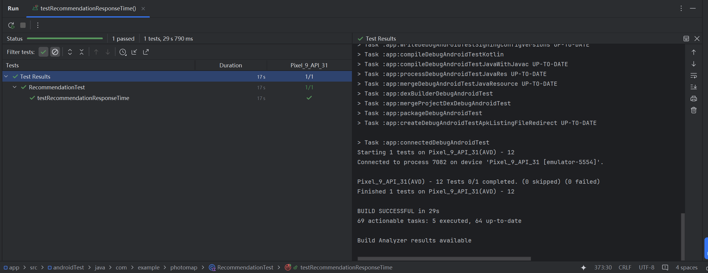
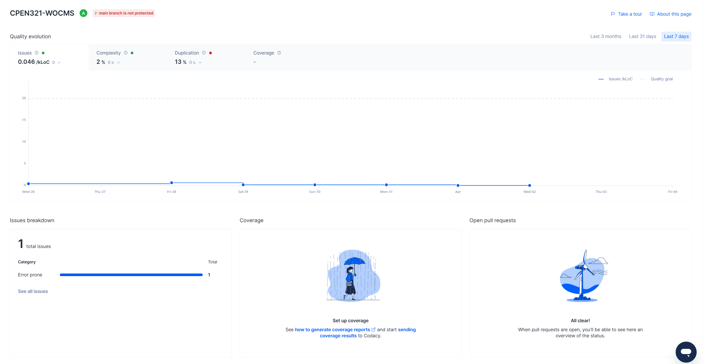
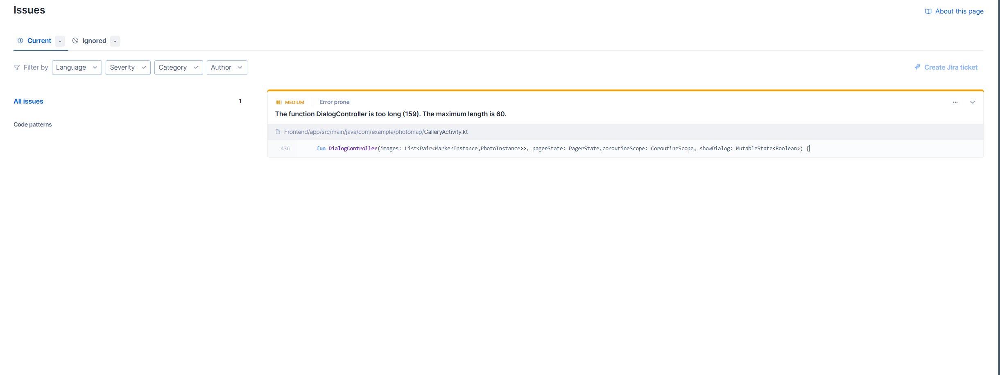

# Example M5: Testing and Code Review

## 1. Change History

| **Change Date**   | **Modified Sections** | **Rationale** |
| ----------------- | --------------------- | ------------- |
| _Nothing to show_ |

---

## 2. Back-end Test Specification: APIs

### 2.1. Locations of Back-end Tests and Instructions to Run Them

#### 2.1.1. Tests

| **Interface**                 | **Describe Group Location, No Mocks**                | **Describe Group Location, With Mocks**            | **Mocked Components**              |
| ----------------------------- | ---------------------------------------------------- | -------------------------------------------------- | ---------------------------------- |
| **POST /upload** | [`backend/tests/unmocked/imageNM.test.ts#L35`](#) | [`backend/tests/mocked/imageM.test.ts#L65`](#) | User DB, Image DB, AWS S3, sharp, S3 presign URL |
| **GET /metadata/:key** | [`backend/tests/unmocked/imageNM.test.ts#L150`](#) | [`backend/tests/mocked/imageM.test.ts#L233`](#) | Image DB, AWS S3 |
| **GET /images/uploader/:uploaderEmail** | [`backend/tests/unmocked/imageNM.test.ts#L172`](#) | [`backend/tests/mocked/imageM.test.ts#L280`](#) | User DB, AWS S3 |
| **GET /images** | [`backend/tests/unmocked/imageNM.test.ts#L195`](#) | [`backend/tests/mocked/imageM.test.ts#L366`](#) | Image DB, AWS S3 |
| **PUT /image/update-description** | [`backend/tests/unmocked/imageNM.test.ts#L207`](#) | [`backend/tests/mocked/imageM.test.ts#L410`](#) | Image DB |
| **POST /image/share** | [`backend/tests/unmocked/imageNM.test.ts#L249`](#) | [`backend/tests/mocked/imageM.test.ts#L483`](#) | Image DB |
| **GET /image/shared/:userEmail** | [`backend/tests/unmocked/imageNM.test.ts#L353`](#) | [`backend/tests/mocked/imageM.test.ts#L510`](#) | Image DB, AWS S3 |
| **POST /image/cancel-share** | [`backend/tests/unmocked/imageNM.test.ts#L368`](#) | [`backend/tests/mocked/imageM.test.ts#L554`](#) | Image DB |
| **DELETE /image/:key** | [`backend/tests/unmocked/imageNM.test.ts#L434`](#) | [`backend/tests/mocked/imageM.test.ts#L328`](#) | Image DB, AWS S3 |
| **DELETE /image/delete-all/:userEmail** | [`backend/tests/unmocked/imageNM.test.ts#L457`](#) | [`backend/tests/mocked/imageM.test.ts#L440`](#) | Image DB, User DB, AWS S3 |
| **POST /user** | [`backend/tests/unmocked/userNM.test.ts#L24`](#) | [`backend/tests/mocked/userM.test.ts#L37`](#) | User DB |
| **GET /user/:googleEmail** | [`backend/tests/unmocked/userNM.test.ts#L76`](#) | [`backend/tests/mocked/userM.test.ts#L59`](#) | User DB |
| **PUT /user/:googleEmail** | [`backend/tests/unmocked/userNM.test.ts#L102`](#) | [`backend/tests/mocked/userM.test.ts#L79`](#) | User DB |
| **GET /users** | [`backend/tests/unmocked/userNM.test.ts#L176`](#) | [`backend/tests/mocked/userM.test.ts#L101`](#) | User DB |
| **POST /user/:googleEmail/location** | [`backend/tests/unmocked/userNM.test.ts#L192`](#) | [`backend/tests/mocked/userM.test.ts#L141`](#) | User DB |
| **POST /user/add-friend** | [`backend/tests/unmocked/userNM.test.ts#L267`](#) | [`backend/tests/mocked/userM.test.ts#L163`](#) | User DB |
| **GET /user/:googleEmail/friends** | [`backend/tests/unmocked/userNM.test.ts#L340`](#) | [`backend/tests/mocked/userM.test.ts#L185`](#) | User DB |
| **POST /user/delete-friend** | [`backend/tests/unmocked/userNM.test.ts#L367`](#) | [`backend/tests/mocked/userM.test.ts#L205`](#) | User DB |
| **DELETE /user/:googleEmail** | [`backend/tests/unmocked/userNM.test.ts#L432`](#) | [`backend/tests/mocked/userM.test.ts#L121`](#) | User DB |
| **GET /map/popular-locations/:userEmail** | [`backend/tests/unmocked/mapNM.test.ts#L432`](#) | [`backend/tests/mocked/mapM.test.ts#L121`](#) [`backend/tests/mocked/mapM_specialReturn.test.ts#L121`](#) | Image DB |


#### 2.1.2. Commit Hash Where Tests Run

`4b36b6ab7d5c677504536205c65ae45bf3e63393`

#### 2.1.3. Explanation on How to Run the Tests

1. **Clone the Repository**:

   - Open your terminal and run:
     ```
     git clone https://github.com/cpen321-wocms/CPEN321-WOCMS.git
     ```

2. **Move to Backend Folder**
    -Run following code in terminal (Windows user)
     ```
     cd .\CPEN321-WOCMS\backend
     ```
    
3. **Install Dependencies**
    - In the backend folder run
     ```
     npm install
     ```

4. **Run Test For All**
    - Run following commend for all the test
     ```
     npm test
     ```

5. **(Optional) Run Test For Without Mocking**
    - Run 
     ```
     npm test tests/unmocked
     ```

6. **(Optional) Run Test For With Mocking**
    - Run 
     ```
     npm test tests/mocked
     ```

### 2.2. GitHub Actions Configuration Location

`~/.github/workflows/test.yml`

### 2.3. Jest Coverage Report Screenshots With Mocks


  
  - Line that not corvered in services.ts is the environment variable check, run acitivite if there is no environment variable
  - The two lines in index.ts is the 400 route validation check. Since our route did not have validation check, so it won't activite. It is copied from tutorial video, and keep for furture. Instead of validation check, we check input in each controller with 404 or 403 status.

### 2.4. Jest Coverage Report Screenshots Without Mocks

__

---

## 3. Back-end Test Specification: Tests of Non-Functional Requirements

### 3.1. Test Locations in Git

| **Non-Functional Requirement**  | **Location in Git**                              |
| ------------------------------- | ------------------------------------------------ |
| **Photo Gallery Upload Speed (Response Time)** | [`tests/NonFunctional/uploadspeed.test.js`](#) |
| **Recommendation Delivery Speed (Response Time)**          | [`Frontend/app/src/androidTest/java/com/example/photomap/RecommendationTest.kt`](#) |

### 3.2. Test Verification and Logs

- **Photo Gallery Upload Speed (Response Time)**

  - **Verification:** This test suite simulates multiple concurrent API calls using Jest to mimic real-world user behavior. The focus is on key endpoints that user create two location markers and upload one phtot to each marker. The test logs capture the general upload speed of photo from API call to backend server, label analyze, and S3 cloud. These logs shows the performence of our backend logic. Also, the Jest describe has a 6s timeout. If the test running time exceed 6s, it will fail automatically. 
  - **Log Output**
    ```
    POST /user 200 69 - 50.170 ms
    PUT /user/exalex16@gmail.com 200 245 - 13.653 ms
    PUT /user/exalex16@gmail.com 200 239 - 6.264 ms
    POST /upload 200 1027 - 2019.652 ms
    POST /upload 200 1033 - 1471.619 ms
    DELETE /image/exalex16@gmail.com-2025-03-16T19-10-15.317Z.png 200 40 - 50.583 ms
    DELETE /image/exalex16@gmail.com-2025-03-16T19-10-17.328Z.png 200 40 - 47.813 ms
    console.log

      Total Test Execution Time: 3.856s

        at tests/NonFunctional/uploadspeed.test.ts:40:13

    console.log
      Image Upload Test 1 Execution Time: 2.045s

        at tests/NonFunctional/uploadspeed.test.ts:41:13

    console.log
      Image Upload Test 2 Execution Time: 1.488s

        at tests/NonFunctional/uploadspeed.test.ts:42:13
    ```

- **Recommendation Delivery Speed (Response Time)**
  - **Verification:** This test measures the time taken from clicking the "Recommendation" button to receiving a response and displaying the recommendation bottom sheet. The test captures the response time for both the backend server call and the external Places API call, ensuring a realistic performance evaluation. Companies such as Google recommend server response thresholds to be around 800 milliseconds. Hence, we determine a suitable requirement of a response time not exceeding 2 seconds, accounting for both backend server response and Places API response. To consider both calls, this test suite is deployed on the frontend, automatically failing if the total response time exceeds the 2-second timeout.
  - **Log Output**

    

---

## 4. Front-end Test Specification

### 4.1. Location in Git of Front-end Test Suite:

`Frontend/app/src/androidTest/java/com/example/photomap/`

### 4.2. Tests

- **Use Case: Upload Photo**

  - **Expected Behaviors - Add Marker:**
    | **Scenario Steps** | **Test Case Steps** |
    | ------------------ | ------------------- |
    | 1. The user clicks on any non-marker-occupied location on the map. | Simulate a screen tap on a non-marker-occupied location|
    | 2. A form appears prompting the user to fill in marker info. | Check that the "Add Marker" dialog appears on screen.<br>Check that the text input field for the marker title is present.<br>Check that the color selection spinner is present.<br>Check that the "Add" and "Cancel" buttons are visible. |
    | 3. The user fills in the marker title and selects a marker color from the form. | Input "Test Marker" into the title text field.<br>Click on the color spinner to open the dropdown.<br>Select the color "Red" from the dropdown list. |
    | 4. The user confirms by clicking "Add." | Click the "Add" button in the dialog. |
    | 5. The marker is created and saved to the database. A message appears notifying the user of success. | Check for a Snackbar message: "Add Marker Successful!".<br>Verify that the new marker is now present on the map. |
    | 3a. The user changes their mind and clicks cancel to abort marker creation. | Click the "Cancel" button in the dialog. |
     | 3a1. The bottom sheet disappears and no marker is created at the frontend. | Check that the "Add Marker" dialog is dismissed.<br>Verify that no new marker has been added to the map. |

  - **Test Logs:**
    - `testAddMarkerDialogAppears`

     

    - `testCancelButtonDismissesDialog`

     

    - `testAddMarkerAndVerifyTitle`

     

  - **Expected Behaviors - Upload Photo:**
    | **Scenario Steps** | **Test Case Steps** |
    | ------------------ | ------------------- |
    | 1. The user selects a marker, and the upload photo button appears. | Tap on an existing marker location.<br>Check that the upload photo button is now visible. |
    | 2. The user clicks the upload button, and a bottom sheet appears prompting them to select a photo. | Click the upload photo button.<br>Verify that the bottom sheet dialog is displayed.<br>Check that the "Pick Photo" button is visible. |
    | 3. The user selects a photo from their device and clicks submit. | Click the "Pick Photo" button.<br>Select an image from the device.<br>Click the "Submit" button. |
    | 4. The system displays a success message. | Check for a success message. |
    | 3a. The user tries to upload a null image. | Open the upload bottom sheet but do not select an image.<br>Click the "Submit" button. |
    | 3a1. The system outputs a message: "No image selected." | Check for an error message indicating that no image was selected. |
   

  - **Test Logs:**
    - `testUploadPhotoNoImageFailure`

     

    - `testUploadPhotoWithMockedPicker`

     


- **Use Case: Receive Recommended Locations**

  - **Expected Behaviors: Receive Recommendation**

    | **Scenario Steps** | **Test Case Steps** |
    | ------------------ | ------------------- |
    | 1. The user clicks the button "Popular Location Notification". | Tap the "Popular Location Notification" button.<br>Verify that a bottom sheet appears. |
    | 2. The system displays a bottom sheet with the user’s most active location and relevant tags. The bottom sheet also contains a list of recommended locations. | Check that the bottom sheet contains the user’s most active location.<br>Verify that relevant tags are displayed.<br>Check that a list of recommended locations is shown. |
    | 3. The user selects a recommended location, and the system creates a marker at the selected location. | Tap on a recommended location from the list.<br>Verify that a new marker is created at the selected location. |
    | 2a1. The user uploads no images or creates no markers. | Ensure the user has no uploaded images or created markers.<br>Click the "Popular Location Notification" button. |
    | 2a1.1. The system displays a message prompting the user to create more markers and upload more images. | Check for a message notifying the user that they need to create more markers and upload more images. |
    | 2a2. No relevant recommendations are available. | Ensure there are no relevant recommendations based on the user’s preferences.<br>Click the "Popular Location Notification" button. |
    | 2a2.1. The system notifies the user that there are no relevant locations that match the user’s preferences. | Check for a message notifying the user that no relevant locations were found. |


  - **Test Logs:**
    - `testRawClickRecommend`

     

    - `testSuccessfulRecommendWithMatch`

     

    - `testSuccessfulRecommendWithNoMatch`
    
     


- **Use Case: Share Image**

  - **Expected Behaviors: Share a Photo from Gallery**

    | **Scenario Steps** | **Test Case Steps** |
    | ------------------ | ------------------- |
    | 1. The user navigates to “Gallery” and selects a picture for sharing | The test simulate this by directly jumping to the gallery activity.<br> Check the image that want to share exist. |
    | 2. The user clicks the image that they want to share and goes to full screen view mode. | Check the full screen is exist. <br>Check the share button exist. <br> Simulate a click on the image that user decided to share |
    | 3. The user click the share button on the bottom right corner below the image.|Check it share button exist. <br> Simlate a click on the share button|
    | 4. The user can either manually enter the user email of the people they want to share to or click the dropdown menu to select the person if he/she is already the user's friend.| Check the dialog for user to enter sharing information exist. <br> Simulate user enters text input.|
    | 5. Users click the button on the pop up window with the text “share” to share the image.| Check the button with text "Share" exist.<br>Simute a click to button|
    | 6. System confirms the image has been shared.| Simulate a click to the share button. <br> Check if the email for the person shared to is included in "People with access" section|
    | 3a. If the image is shared by someone else to you, then you don’t have permission to share this image and thus the share button will not appear.| Check the share button does not exist|
    | 6a. The system notifies the email that the user wants to share the image to is either invalid or not a user of this app. | Simulate a click to the share button. <br> Check if the email for the person shared to is not included in "People with access" section |


  - **Test Logs:**
    - `testShareWithAnSharedImage`

     

    - `testShareWithInvalidInput`

     

    - `testSuccessShare`
    
     

---

## 5. Automated Code Review Results

### 5.1. Commit Hash Where Codacy Ran

`f78b01ee70ee2adc8dc8c3faffa3ec827e003555`

### 5.2. Unfixed Issues per Codacy Category

__

### 5.3. Unfixed Issues per Codacy Code Pattern

__

### 5.4. Justifications for Unfixed Issues

- **Code Pattern: [One method should have one responsibility. Long methods tend to handle many things at once. Prefer smaller methods to make them easier to understand.](#)**

  1. **The function Gallery is too long (66). The maximum length is 60.**

     - **Location in Git:** Frontend/app/src/main/java/com/example/photomap/
GalleryActivity.kt
     - **Justification:** ​
        - Gallery is a compose UI function. It can't be reduced to smaller functions otherwise the styling would be inconsistent.
  
  2. **The function FullScreenImageViewer is too long (173). The maximum length is 60.**

     - **Location in Git:** Frontend/app/src/main/java/com/example/photomap/
GalleryActivity.kt
     - **Justification:** ​
        - FullScreenImageViewer is a compose UI function. I have tried to broken this into smaller functions but result in messed up UI. It can't be reduced to smaller functions otherwise the styling would be inconsistent.

  3. **The function DialogController is too long (159). The maximum length is 60.**

     - **Location in Git:** Frontend/app/src/main/java/com/example/photomap/
GalleryActivity.kt
     - **Justification:** ​
        - DialogContoller is a compose UI function. I have tried to broken this into smaller functions but result in messed up UI. It can't be reduced to smaller functions otherwise the styling would be inconsistent.

- **Code Pattern: [Others](#)**

  1. **The function uploadPhoto(image: MultipartBody.Part, description: RequestBody, uploader: RequestBody, location: RequestBody, sharedTo: RequestBody, shared: RequestBody, sharedBy: RequestBody) has too many parameters. The current threshold is set to 6.**

     - **Location in Git:** Frontend/app/src/main/java/com/example/photomap/
ApiService.kt
     - **Justification:** ​The parameters of this function are all the necessary information of the image which can not be reduced. 
        

  


  